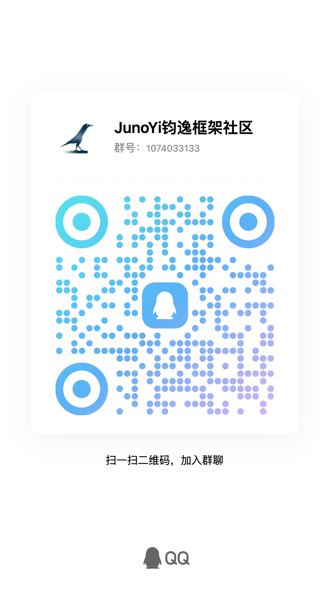

<div align="center">
    
    <h1>JunoYi 钧逸</h1>
    <p><strong>安全内建 · 开箱即用 · 企业级 Java 开发框架</strong></p>
    <p>基于 Spring Boot 3.5 + Java 21 打造的现代化企业应用开发脚手架</p>
</div>

<div align="center">

[](https://www.oracle.com/java/)
[](https://spring.io/projects/spring-boot)
[](https://baomidou.com/)
[](https://vuejs.org/)
[](https://element-plus.org/)
[](LICENSE)
[](https://github.com/Juno-Yi/JunoYi)

</div>

<div align="center">

📖 [在线文档](https://doc.framework.junoyi.com) • 🎮 [在线演示](https://demo.junoyi.com) • 📡 [API 文档](https://p94fvkojhd.apifox.cn/) • 💬 [加入社群](#-联系我们)

</div>

---

## ✨ 为什么选择 JunoYi？

### 🎯 **核心亮点**

#### 1、混合动态权限模型体系：

像传统RuoYi或相关类似框架还是采用 `RBAC` 权限模型，权限始终围绕 `角色`与`菜单` 走，JunoYi 支持更灵活的权限配置方式。权限不再完全依赖角色绑定，
支持动态调整，配置实时生效。

一个功能页面管理页面，如“用户管理”，该页面的权限就是为`user.ui.list.view`（用户模块.ui.列表页面.页面权限）,添加用户按钮权限为`user.ui.list.add.button`（用户.ui.列表页面.添加.按钮），
添加用户API接口权限为`user.api.list.add`。这是基本的权限使用场景，可以通过这里权限体系，精细控制前端菜单页面权限、UI显示权限、API调用权限。

除此之外，我们可以给数据加权限！例如获取用户列表接口，返回UserVO 响应数据列表，我们想要用户没有字段读取权限的，显示字段为空或者加密隐藏，就可以通过`注解方式`在`UserVO`类中给对应字段加入权限控制；
或者要写入数据，给后端 DTO 数据对象某字段加上写入权限控制。

例如：phonenumber字段权限为`user.data.phonenumber.read`（用户模块.数据.手机号.读取），我们给字段加入读取权限后，如果用户没有权限就无法正常获取该字段完整信息。

idCard字段加入`user.data.idCard.write`（用户模块.数据.身份证.写入），加入写入权限后，如果用户没有权限就无法写入该数据，这条数据插入或者更新到数据表中该字段就会为`null`。

##### 2、多平台原生支持

在登录时候，框架提供多种策略，可以实现接口只允许在指定平台进行调用，并且框架默认提供平台类型 `后台管理WEB`、`前台WEB`、`小程序`、`H5`、`移动端APP`、`桌面端`等默认平台枚举，可以自行拓展平台类型。
并且框架采用 `双Token机制`: `AccessToken` 与 `RefreshToken`，可以随平台定制不同平台的会话时长；支持无感刷新，实时会话监控，可以随时踢出用户登录会话。

##### 3、企业级组件支持

为了方便商业项目开发，框架将陆续提供多种常用部分基础设施支持，不需要重新造轮子，直接调用即可！

基础设施：

- 企业微信支持
- 微信支持（微信小程序）
- 微信支付支持
- 飞书支持
- 支付宝支持（支付宝小程序）
- 支付宝支付
- 钉钉支持

> 后续将不断拓展更新！具体详情请查看官方文档为准：http://doc.framework.junoyi.com

---

## 🛠️ 技术栈

### 后端技术

| 技术 | 版本 | 说明 |
|------|------|------|
| Spring Boot | 3.5.0 | 应用框架 |
| Java | 21 | 开发语言 |
| MyBatis-Plus | 3.5.9 | ORM 框架 |
| MySQL | 8.0+ | 关系型数据库 |
| Redis | 7.0+ | 缓存数据库 |
| Redisson | 3.x | 分布式锁 |
| JWT | - | 身份认证 |
| Knife4j | 4.x | API 文档 |
| Hutool | 5.x | 工具类库 |
| MapStruct | 1.6.x | 对象转换 |

### 前端技术

| 技术 | 版本 | 说明 |
|------|------|------|
| Vue | 3.x | 前端框架 |
| TypeScript | 5.x | 开发语言 |
| Element Plus | latest | UI 组件库 |
| Vite | 5.x | 构建工具 |
| Pinia | 2.x | 状态管理 |
| Vue Router | 4.x | 路由管理 |

---

## 🚀 快速开始

### 环境要求

- **Java**: 21+
- **Maven**: 3.9+
- **MySQL**: 8.0+
- **Redis**: 7.0+
- **Node.js**: 18+ (前端)

### 一键创建项目

使用官方 CLI 工具快速创建项目：

```bash
# 使用 pnpm (推荐)
pnpm create junoyi

# 或使用 npm
npm create junoyi

# 或使用 yarn
yarn create junoyi
```

CLI 工具将引导你完成：
- ✅ 选择代码托管平台（Gitee / GitHub）
- ✅ 选择项目架构（单体 / 多租户 / 微服务）
- ✅ 选择前端模板（Vue3 + Element Plus / Ant Design Vue / uni-app）
- ✅ 检测开发环境
- ✅ 自定义模块名和包名（可选）

### 手动启动

**1. 克隆项目**

```bash
# Gitee (国内推荐)
git clone https://gitee.com/juno-yi/JunoYi.git

# GitHub
git clone https://github.com/Juno-Yi/JunoYi.git
```

**2. 导入数据库**

```bash
# 创建数据库
CREATE DATABASE junoyi DEFAULT CHARACTER SET utf8mb4 COLLATE utf8mb4_unicode_ci;

# 导入 SQL 文件
mysql -u root -p junoyi < sql/MySQL/junoyi.sql
```

**3. 修改配置**

编辑 `junoyi-server/src/main/resources/application-local.yml`：

```yaml
spring:
  datasource:
    url: jdbc:mysql://localhost:3306/junoyi?useUnicode=true&characterEncoding=utf8
    username: root
    password: your_password
  data:
    redis:
      host: 127.0.0.1
      port: 6379
```

**4. 启动后端**

```bash
# 方式一：IDEA 运行
# 打开 junoyi-server 模块，运行 JunoYiServerApplication 主类

# 方式二：Maven 命令
mvn spring-boot:run

# 方式三：打包运行
mvn clean package
java -jar junoyi-server/target/junoyi-server-0.6.4.jar
```

**5. 启动前端**

```bash
cd junoyi-ui/junoyi-vue-elementPlus
pnpm install
pnpm dev
```

**6. 访问系统**

- 前端地址：http://localhost:5173
- 后端地址：http://localhost:7588
- API 文档：http://localhost:7588/doc.html

### 演示环境

🎮 **在线演示**：http://demo.junoyi.com

| 角色 | 账号 | 密码 | 说明 |
|------|------|------|------|
| 超级管理员 | super_admin | admin123 | 拥有所有权限 |
| 用户管理员 | admin | admin123 | 部分管理权限 |
| 普通用户 | user1 | admin123 | 基础权限 |

> ⚠️ 演示环境仅供体验，请勿进行压力测试或攻击行为

---

## � 核心功能

### 系统管理
- **用户管理**：用户信息维护、角色分配、部门分配
- **角色管理**：角色权限配置、数据权限设置
- **菜单管理**：菜单树维护、权限标识配置
- **部门管理**：组织架构树形管理
- **字典管理**：系统字典数据维护
- **参数管理**：系统参数配置
- **通知公告**：系统通知发布管理
- **操作日志**：用户操作日志记录与查询
- **登录日志**：用户登录日志记录与查询

### 开发工具
- **API 文档**：基于 Knife4j 的在线 API 文档
- **系统监控**：服务器性能监控、JVM 监控
- **定时任务**：基于 Quartz 的定时任务管理

### 安全防护
- **端到端加密**：基于 RSA + AES 的接口加密
- **XSS 防护**：自动过滤 XSS 攻击脚本
- **SQL 注入防护**：参数化查询 + 关键字过滤
- **图形验证码**：登录验证码
- **Token 认证**：基于 JWT 的无状态认证
- **密码加密**：BCrypt 密码加密存储

### 权限控制
- **接口权限**：基于注解的接口权限控制
- **字段权限**：敏感字段脱敏与权限控制
- **数据权限**：基于部门的数据范围控制
- **菜单权限**：前端菜单动态加载

---

## 🏗️ 项目架构

### 模块结构

```
JunoYi
├── junoyi-dependencies        # 依赖版本管理
├── junoyi-framework           # 框架核心模块
│   ├── junoyi-framework-core          # 核心工具类
│   ├── junoyi-framework-web           # Web 基础设施
│   ├── junoyi-framework-security      # 安全认证
│   ├── junoyi-framework-permission    # 权限控制
│   ├── junoyi-framework-datasource    # 数据源配置
│   ├── junoyi-framework-redis         # Redis 缓存
│   ├── junoyi-framework-captcha       # 验证码
│   ├── junoyi-framework-api-doc       # API 文档
│   ├── junoyi-framework-log           # 日志框架
│   ├── junoyi-framework-excel         # Excel 处理
│   ├── junoyi-framework-json          # JSON 处理
│   ├── junoyi-framework-event         # 事件总线
│   ├── junoyi-framework-quartz        # 定时任务
│   ├── junoyi-framework-file          # 文件管理
│   ├── junoyi-framework-wework        # 企业微信
│   └── junoyi-framework-boot-starter  # 框架启动器
├── junoyi-module              # 业务模块
│   ├── junoyi-module-system           # 系统管理模块
│   └── junoyi-module-demo             # 示例模块
├── junoyi-server              # 启动入口
└── junoyi-ui                  # 前端项目
    ├── junoyi-vue-elementPlus         # Vue3 + Element Plus
    └── junoyi-uniapp                  # uni-app 移动端
```


---

## 📚 文档

完整文档请访问：**http://doc.framework.junoyi.com**

| 分类 | 内容 |
|------|------|
| 🚀 快速开始 | 环境准备、项目启动、基础配置 |
| 🏗️ 架构设计 | 项目结构、模块划分、技术选型 |
| 🔐 权限系统 | 混合权限模型、RBAC、字段级权限 |
| 🛡️ 安全防护 | XSS/SQL注入防护、端到端加密 |
| 📝 开发指南 | 模块开发、对象转换、日志框架 |
| 🔌 组件集成 | 验证码、API文档、缓存管理 |

---

## 🗓️ 版本规划

| 版本 | 说明 | 状态            |
|------|------|---------------|
| 前后端分离版 | 当前版本，适合中小型项目 | ✅ 正式发布 v0.6.4 |
| 多租户版 | 支持 SaaS 多租户架构 | 🚧 商业项目实践中    |
| 微服务版 | 基于 Spring Cloud 的分布式架构 | 📋 规划中        |

📝 **更新日志**：https://doc.framework.junoyi.com/changelog/java/standalone.html

---

## 🤝 贡献指南

欢迎提交 Issue 和 Pull Request！

### 贡献流程

1. Fork 本项目
2. 创建新分支 (`git checkout -b feature/AmazingFeature`)
3. 提交更改 (`git commit -m 'Add some AmazingFeature'`)
4. 推送到分支 (`git push origin feature/AmazingFeature`)
5. 提交 Pull Request

### 代码规范

- 遵循阿里巴巴 Java 开发手册
- 保持代码风格一致
- 添加必要的注释和文档
- 编写单元测试

---

## 📞 联系我们

如果你在使用过程中遇到问题，或者有任何建议，欢迎通过以下方式联系我们：

- **QQ 群**：1074033133
- **邮箱**：eatfan0921@163.com
- **GitHub**：https://github.com/Juno-Yi/JunoYi
- **Gitee**：https://gitee.com/juno-yi/JunoYi

<div align="center">
    
    <p>扫码加入 QQ 群</p>
</div>

---

## ☕ 关注项目

为了第一时间获取项目更新、功能预告、版本发布、开发教程以及更多企业级项目实践内容，欢迎关注我们的官方公众号：

<div align="center">
    
</div>

**你可以在公众号获取：**
- 最新版本更新通知
- 项目开发进度与路线图
- 企业级项目实战教程
- Java / Spring Boot / Vue 技术分享
- 开源项目生态与插件扩展
- 官方技术交流与问题反馈
- 商业合作
- 定制开发支持

---

## 📄 许可证

本项目采用 MIT 许可证 - 详见 [LICENSE](LICENSE) 文件

---

## 🔗 相关项目

- [JunoYi Vue3 前端 (GitHub)](https://github.com/Juno-Yi/JunoYi-Vue-ElementPlus) - 基于 Vue3 + Element Plus 的管理后台
- [JunoYi Vue3 前端 (Gitee)](https://gitee.com/juno-yi/juno-yi-vue-element-plus) - 基于 Vue3 + Element Plus 的管理后台

---

## ⭐ Star History

[](https://star-history.com/#Juno-Yi/JunoYi&Date)

---

<div align="center">

**⭐ 如果这个项目对你有帮助，请给个 Star 支持一下！**

Made with ❤️ by [JunoYi Team](https://junoyi.com)

</div>
